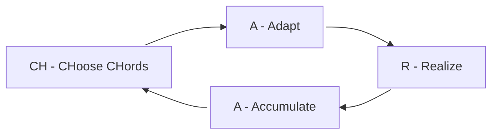

## 0. Prerequisites

### What is a chorded entry?

Chorded entry, or chording, is a text input method where multiple keys are pressed simultaneously to produce letters, numbers, or commands, similar to playing a chord on a piano.

For example, the following is a chord on a CharaChorder device. I pressed and released the h and w keys simultaneously, and the device typed "Hello, World!" for me.




If you look closely, you can see the keys I pressed and released, `h` and `w`, had been produced and removed before the `Hello, World!` was produced. We call the keys one pressed and released at the same time, `h` and `w` in this example, as “chord input”, and the output of the chord, `Hello, World!` in this example, as “chord output”. This chord can be represented as `h+w = Hello, World!`.

### When should I start learning chorded entry?

There is no strict limitation on when you should start learning chorded entry. Generally, I suggest users start learning chorded entry when they reach 40 WPM in character entry, which is the average typing speed. But if you aim for chord everything when typing, like on a steno machine, you can start earlier, like when you can remember each key’s position on your layout.

### Should I set up some goals?

Without goals, one can easily get lost in the learning process. I would suggest you clarify what you want to achieve before and during the learning process. This would help you decide what to include in your chord library and plan the training environment.

There can be some speed goals, like reaching a target speed (60/100/150/250 WPM) under a specific set (English 200/1k/…) at Monkeytype, especially for those who aim for the special earned roles on CharaChorder Discord server. For these kinds of goals, you can imagine that your chord library should have enough coverage over the target word set, and some training more focused on speed.

On the other side, they can be something like using the chords only for some hard words that occur in your use cases. For this kind of goal, your chord library would tend to cover those special words instead of general common words. The training can be more casual than the above.

## 1. Set up the chord library

### Which chord library should I use, or should I make my own?

I would suggest you start from a sketch and decide on each chord in your chord library. Since the chord inputs are up to you, they will make a better impression on you. Yes, even deciding the chord inputs is a part of the learning process.

However, if you prefer not to decide all the chords by yourself and there is an existing chord library that fits your needs, you can get that one and start from it.

### How should I add new chords?

Deciding the chord is a big question, and due to individual differences, the best way for each user might not be easily determined. However, I will show you some brief rules and suggestions below.

#### Rules for deciding chord input

When adding a new chord for a word or a phrase, the first problem might be what its chord input should be.

There are two extremes for this. One is choosing keys based solely on the output; the other is choosing keys without considering the output. For simplicity, I name the former as “Diatonic rule” and the latter as “Chromatic rule”.

##### Diatonic rule

For example, `a+n+o = annotation` in my chord library. I take several characters from the output as input. I would usually take the first character and some characters from the remainder.

It's easier to recall the chord input with its output before you construct the muscle memory; however, as you add more chords into your library, you will start finding some conflict between them and have to trade off between them or add some additional, unrelated keys.

##### Chromatic rule

On the other side, the ultimate way to prevent the conflict is to let the chord input be independent from the chord output, like just find an unused chord input for the word without considering the characters in that word.

This way, the chord will never get conflicted, and you can effectively use any possible combinations. However, you have to take a bit more time to construct the muscle memory for chord libraries built with this rule.

#### My suggestions

##### Frequently words first

I suggest you make the chords for the words that are more frequently used as early as possible, so they can occupy the good, short chord inputs first.

##### Diatonic first

Due to the ease of learning, I suggest you try to use the diatonic rule to decide the chord input first. If you don’t find any usable chord input, add some non-related keys into it, i.e., a mixture of diatonic and chromatic rules.

#### Keep learned chords

If you already have good muscle memory for a chord, I suggest not changing it when it conflicts with a new chord; instead, choose a different chord input for the new chord.

## 2. Learn the chords

### How should I learn chording?

Unlike for character entry, where you can type out almost all the words after you learn all the letter keys, the number of words and phrases you use chord entry to type is much larger, and it will progressively increase.

Since there is no clear destination for learning chord progressions, I introduce a learning cycle, called the “CHARA”, to become familiar with a small set of chords at a time.

### What's CHARA cycle?

CHARA stands for 4 phases, CHoose CHords, Adapt, Realize, and Accumulate.

1. CH - choose CHords: Choose a batch of chords (3 ~ 5 chords) to learn in this iteration.
2. A - Adapt: Get familiar with those chords in the batch with some kind of visual guide or text note.
3. R - Realize: Practice those chords with the on-demand guide. (You can get a glimpse of the guide when you really forget the chord input of a word.)
4. A - Accumulate: Practice with all chords you’ve learned so far.

Next, I would break down each phase.

#### CH - choose CHords

The first phase in the cycle is to choose 3-5 chords to enter the learning cycle. I would suggest starting with the most frequent words in your chord library. You can get the [top 20k English words list from Google](https://github.com/first20hours/google-10000-english/blob/master/20k.txt) or [the top 1k English words list from Monkeytype](https://github.com/monkeytypegame/monkeytype/blob/master/frontend/static/languages/english_1k.json) for comparing the word frequency.

I also suggest you use a spreadsheet to record which chords you choose to learn. This will help you generate practice sets and track your learning.

#### A - Adapt

For the chords you chose in the previous phase, prepare some notes for their chord input and output in any way you like. It could be real or virtual sticky notes, or a specific chord-training application with a visual guide.

Practice them in a typing or chord training application. Focus on doing each chord correctly first and getting familiar with the finger action for each chord.

I would suggest a target speed of 30 chords per minute (ChPM). (>= 30 WPM)

#### R - Realize

Next, we should start getting away from the guide.

For the chords passing the previous phase, keep the notes or guides where you can access them, but you can only get a glimpse of the guide when you really forget the chord input of a word.

Same as above, practice them in a typing or chord training application. However, focus on memorizing the linkage between the chord output and the finger action, i.e., for typing this word, I should move the finger like that.

I would suggest a target speed of 50 ChPM. (>= 50 WPM)

#### A - Accumulate

The accumulation phase is the final phase each learned chord eventually reaches. You can see this phase as a review phase.

You don't have to do this phase at each cycle. You can do when you have realized around 15 or more new chords.

Yes, just practice all the chords you’ve learned so far in a typing or chord training application. If your goals are speed goals, you can also start doing a typing test at Monkeytype.

Also, in this phase, you can focus more on looking ahead and planning the next 1-2 actions, i.e., try to link the chords actions together instead of hitting them individually.

You might find there are some chords you are less familiar with; gather them up and do some focused training on them.

I would suggest target speed of 60 ChPM. (>= 60 WPM) You can even set it higher based to your goal.
