```mermaid
gantt
    title Learning stages and their recommended WPM ranges
    dateFormat X
    axisFormat %s
    Memorize device layout without device: milestone, 0, 0
    Practice device layout   : 0, 13
    Practice letters in-depth: 13, 30
    Practice trigram: 13, 23
    Practice words: 20, 40
    Use in real life: milestone, 20, 20
```

## Memorize device layout without device

- Purpose: Memorize the locations of each key when the device is not at your fingertips, such as when you are waiting for the shipment.
- Recommended tool:
  - [My Anki deck for letter keys on the default device layout](https://ankiweb.net/shared/info/1396809787)
  - Air typing with Number, letter, and symbol lessons at [Alnitak](https://andy23512.github.io/alnitak/) with its air mode setting on
  - [Layout song at Alnitak](https://andy23512.github.io/alnitak/layout-song)
- Recommended goal:
  - You can recall where any key is without any visual guide.
  

[Anki](https://apps.ankiweb.net/) offers a feature called [Image Occlusion](https://docs.ankiweb.net/editing.html?highlight=image#image-occlusion). Download the default layout image ([CC1/2](https://docs.charachorder.com/_images/CCEnglish2.png) or [Master Forge](https://docs.charachorder.com/_images/M4-Layout.png)) and create cards that hide specific parts of the layout to help you memorize it. I also made a deck for the letter keys on the default layout, and you can [access it here](https://ankiweb.net/shared/info/1396809787).

Air typing involves mimicking typing gestures with your fingers, either in the air, on a table, or even on your hand or leg. The practice tool I developed, [Alnitak](https://andy23512.github.io/alnitak), also features an air mode setting. It automatically advances lessons at the speed you set, allowing you to follow along and move your fingers as if typing on a real device.

Additionally, there is [an AI-generated layout song at Alnitak](https://andy23512.github.io/alnitak/layout-song) that can help you memorize the default layout.



## Practice device layout

- Purpose: Get familiar with the locations of each key until you don't need the visual guides
- Recommended WPM: 0~13
- Recommended tool:
  - Letters tier at [dot i/o](https://www.iq-eq.io/#/)
  - Alphabetic tier at [CharaChorder LaunchPad](https://launchpad.charachorder.com/#/)
  - Number, letter, and symbol lessons at [Alnitak](https://andy23512.github.io/alnitak/)
  - Guided, source code and numbers lessons at [Keybr](https://www.keybr.com/) with Keybr CC Extension ([Chrome Web Store](https://chromewebstore.google.com/detail/keybr-cc-extension/fdofhfbipdhkkhhdjlfjnjfnkibpbdpg) / [Firefox Add-ons](https://addons.mozilla.org/en-US/firefox/addon/keybr-cc-extension/))
    - P.S. It's recommended to set the target speed to 15 here.
  - English set at [Monkeytype](https://monkeytype.com/) with Monkeytype CC Extension ([Chrome Web Store](https://chromewebstore.google.com/detail/mhfjhmegecimjbohhdbflkhdfnaadple) / [Firefox Add-ons](https://addons.mozilla.org/en-US/firefox/addon/monkeytype-cc-extension/))
- Recommended goal:
  - Reach 13 WPM at Letters tier at [dot i/o](https://www.iq-eq.io/#/) or Alphabetic tier at [CharaChorder LaunchPad](https://launchpad.charachorder.com/#/)
  - Reach 100 Combos and 100 CPM at non-review lessons at [Alnitak](https://andy23512.github.io/alnitak/)
  - All the letters become green at [Keybr](https://www.keybr.com/)
  - Reach 13 WPM at English set at [Monkeytype](https://monkeytype.com/)

Unlike standard keyboards, CharaChorder 3D input devices, including CharaChorder One, CharaChorder Two, and Master Forge, don't have key labels on them, so learning touch typing is crucial for practical use. Therefore, the first thing we need to get familiar with is the positions of each key.

The official training applications ([dot i/o](https://www.iq-eq.io/#/) and [CharaChorder LaunchPad](https://launchpad.charachorder.com/#/)) have corresponding tiers for this. You can follow the visual guide and practice all the letters there.

Dot i/o and CharaChorder LaunchPad can not display the default layout of M4G. However, most of the keys they support are positioned the same as in the default layouts for CC1/2 and M4G. As a result, you can still use them with M4G.

Besides, [Alnitak](https://andy23512.github.io/alnitak/) is a tool specially designed for practicing device layout on CharaChorder 3D input devices. Character keys, including numbers, letters, and symbols, are divided into small lessons, allowing users to focus on a small set of keys at a time. Moreover, the visual guide fades out when users reach 20 combos, and it reappears when there is a mistake. It helps users memorize the location and prevents them from simply following the guide.

[Keybr](https://www.keybr.com/) doesn't have built-in visual guides for CharaChorder 3D input devices, but Keybr CC Extension ([Chrome Web Store](https://chromewebstore.google.com/detail/keybr-cc-extension/fdofhfbipdhkkhhdjlfjnjfnkibpbdpg) / [Firefox Add-ons](https://addons.mozilla.org/en-US/firefox/addon/keybr-cc-extension/)), a browser extension I developed, can add them to Keybr.

If you prefer to get familiar with the layout by typing real words, you can practice at [Monkeytype](https://monkeytype.com/) with Monkeytype CC Extension ([Chrome Web Store](https://chromewebstore.google.com/detail/monkeytype-cc-extension/mhfjhmegecimjbohhdbflkhdfnaadple) / [Firefox Add-ons](https://addons.mozilla.org/en-US/firefox/addon/monkeytype-cc-extension/)). It's another browser extension I developed, similar to the Keybr CC Extension. Note that the default English set on Monkeytype only contains one word with 'j' and does not include words with 'q', 'x' or 'z'. You need to select a different set or use custom words to practice those letters.


## Practice letters in-depth

- Purpose: Strengthen your muscle memory with the letters
- Recommended WPM: 13~30
- Recommended tool:
  - Constitution Training/Test Module at [CCIO](https://adventure.charachorder.io/)
  - Guided Lessons at [Keybr](https://www.keybr.com/) (without visual guide)
    - P.S. It's recommended to set the target speed to 30. You can also start with a lower speed and gradually increase it to 30 according to your learning pace and progress.
- Recommended goal:
  - Get S or S+ rank under Novice class of Constitution Test Module at [CCIO](https://adventure.charachorder.io/)
  - All the letters become green at [Keybr](https://www.keybr.com/)

[CCIO](https://adventure.charachorder.io/) is an official revolutionary typing game and integrated platform. Its constitution module allows you to train and test your familiarity with the device layout. Since the layout reference does not indicate the current key position, I suggest using this after you have learned the device layout above.

Besides, [Keybr](https://www.keybr.com/) helps users learn touch typing. If you've learned the device layout above, you can use Keybr to strengthen your muscle memory of the letters further. Its default target speed is 35 WPM, but it might take users weeks to unlock the 7th letters and months to complete all the letters, so 30 is recommended here. If it's still too hard for you, start with a lower target speed and gradually increase it as you pace yourself.


## Practice trigrams

- Purpose: Practice common letter groupings
- Recommended WPM: 13~27
- Recommended tool:
  - Trigram tier at [dot i/o](https://www.iq-eq.io/#/)
  - Amalgamate tier at [CharaChorder LaunchPad](https://launchpad.charachorder.com/#/) 
- Recommended goal:
  - Reach 27 WPM

The official training applications ([dot i/o](https://www.iq-eq.io/#/) and [CharaChorder LaunchPad](https://launchpad.charachorder.com/#/)) have corresponding tiers for practicing common trigrams in English. Practicing these trigrams would help you type faster in general since many words include those trigrams.


## Practice words

- Purpose: Practice common words
- Recommended WPM: 20~40
- Recommended tool:
  - Dexterity Training/Test Module at [CCIO](https://adventure.charachorder.io/)
  - Words tier at [dot i/o](https://www.iq-eq.io/#/)
  - Lexical tier at [CharaChorder LaunchPad](https://launchpad.charachorder.com/#/)
  - English set at [Monkeytype](https://monkeytype.com/)
- Recommended goal:
  - Get S or S+ rank under the Medium class of the Dexterity Test Module at [CCIO](https://adventure.charachorder.io/)
  - Reach 40 WPM at corresponding tiers at [dot.io](https://www.iq-eq.io/#/) and [CharaChorder LaunchPad](https://launchpad.charachorder.com/#/)
  - Reach 40 WPM at English set at [Monkeytype](https://monkeytype.com/)

The official training applications ([CCIO](https://adventure.charachorder.io/), [dot i/o](https://www.iq-eq.io/#/), and [CharaChorder LaunchPad](https://launchpad.charachorder.com/#/)) have corresponding tiers or modules for practicing common words in English.

[Monkeytype](https://monkeytype.com/) is a popular tool for short-term typing practices and typing speed tests.


## Use in real life

- Purpose:
  - Get familiar with using the device in your use cases
  - Fine-tune the layout and settings of your device to fit your use cases
- Recommended WPM: 20~

Integrating the CC 3D input devices into your real-world use case is essential. Try to do small things with them.

For example, you can write short articles, code small programs, or do anything else that involves keyboards. You might find some key locations or settings you want to change.

